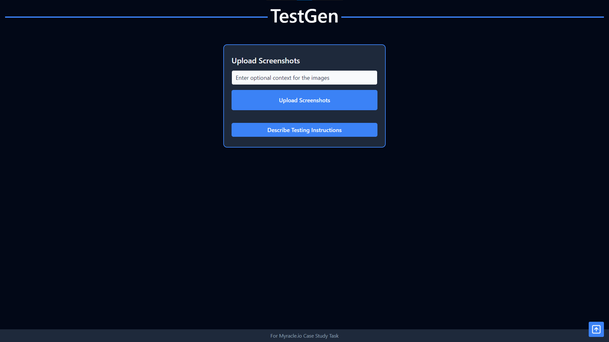
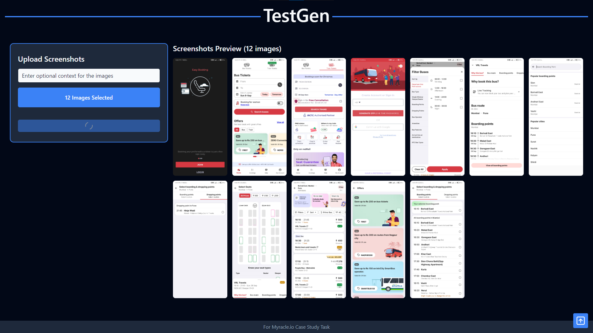
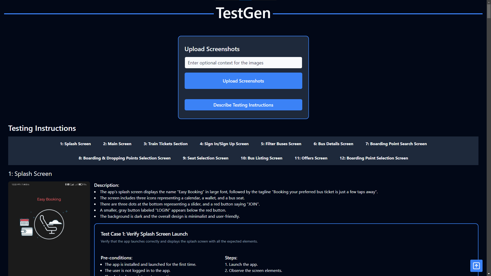

# TestGen

## Description

This is a simple test generator that uses screenshots to describe the test cases. It is a simple tool that can be used to generate test cases for a given application. The tool is designed to be used by developers and testers to generate test cases for their applications.

It uses a Mutli-Modal LLM model to generate test cases. The model is trained on a dataset of screenshots and their corresponding test cases. The model is able to generate test cases for a given screenshot by using the information in the screenshot.

## Technologies

- Node.js
- Google Gemini (Multi-Modal LLM)
- React.js (Vite)
- Tailwind CSS

## Installation

Requirements: Node.js

1. Clone the repository
1. Open the terminal in the project directory
1. Run `npm install`
1. Run `npm run dev`
1. Open `http://localhost:5173` in your browser

## Usage

1. Upload one or more screenshots
1. Provide additional information (optional)
1. Click on the "Describe Testing Instructions" button
1. View the generated test cases

## Images







## Prompting Strategy

- The tool uses the Google Gemini Multi-Modal LLM model to generate test cases.
- It takes advantage of JSON output feature of the model to generate test cases in a structured format.
- It uses a multi-step process to generate test cases:
  1. Describe the screenshots
  1. Generate test cases
- This uses the chat-session feature to maintain the context of the conversation.  

### System Instructions

> You are a software tester. You will be given screenshots of an application. Analyse the various elements in the screenshots and answer the following questions in a precise manner. This information will be used by developers to write test cases for the application.

## JSON Schema

### Screenshot Description Schema

```typescript
{
    type: SchemaType.ARRAY,
    description: "Each object represents a screenshot with its description.",
    items: {
      type: SchemaType.OBJECT,
      properties: {
        screenshotNo: {
          type: SchemaType.NUMBER,
          description: "The screenshot number starting from 1.",
        },
        screenshotTitle: {
          type: SchemaType.STRING,
          description: "The title of the screenshot.",
        },
        screenshotDescription: {
          type: SchemaType.ARRAY,
          items: { type: SchemaType.STRING },
          description: "Each string represents a description of the five most important elements in the screenshot.",
        },
      },
      required: ["screenshotNo", "screenshotTitle", "screenshotDescription"],
    },
  }
```

### Test Cases Schema

```typescript
{
    type: SchemaType.ARRAY,
    description: "Each object represents a unique test case for a screenshot.",
    items: {
      type: SchemaType.OBJECT,
      required: ["screenshotNo", "screenshotTitle", "testCases"],
      properties: {
        screenshotNo: {
          type: SchemaType.NUMBER,
          description: "The screenshot number starting from 1.",
        },
        screenshotTitle: {
          type: SchemaType.STRING,
          description: "The title of the screenshot.",
        },
        testCases: {
          type: SchemaType.ARRAY,
          description: "Each object represents a test case for the screenshot.",
          items: {
            type: SchemaType.OBJECT,
            required: [
              "testCaseID",
              "testCaseName",
              "testCaseDescription",
              "preConditions",
              "steps",
              "data",
              "expectedResult",
              "postConditions",
            ],
            properties: {
              testCaseID: {
                type: SchemaType.NUMBER,
                description: "The test case ID.",
              },
              testCaseName: {
                type: SchemaType.STRING,
                description: "The test case name.",
              },
              testCaseDescription: {
                type: SchemaType.STRING,
                description: "The test case description.",
              },
              preConditions: {
                type: SchemaType.ARRAY,
                items: { type: SchemaType.STRING },
                description: "The pre-conditions for the test case.",
              },
              steps: {
                type: SchemaType.ARRAY,
                items: { type: SchemaType.STRING },
                description: "The precise steps for the test case.",
              },
              data: {
                type: SchemaType.ARRAY,
                description: "The data for the test case.",
                items: {
                  type: SchemaType.OBJECT,
                  description: "Each object represents a data entry.",
                  properties: {
                    name: {
                      type: SchemaType.STRING,
                      description: "The name of the data entry.",
                    },
                    type: {
                      type: SchemaType.STRING,
                      description: "The type of the data entry.",
                    },
                  },
                },
              },
              expectedResult: {
                type: SchemaType.STRING,
                description: "The expected result.",
              },
              postConditions: {
                type: SchemaType.ARRAY,
                items: { type: SchemaType.STRING },
                description: "The post-conditions for the test case.",
              },
            },
          },
        },
      },
    },
  }
```

## Acknowledgements

This project was done in fulfillment for the Case Study Task for Myracle.io internship interview process.
